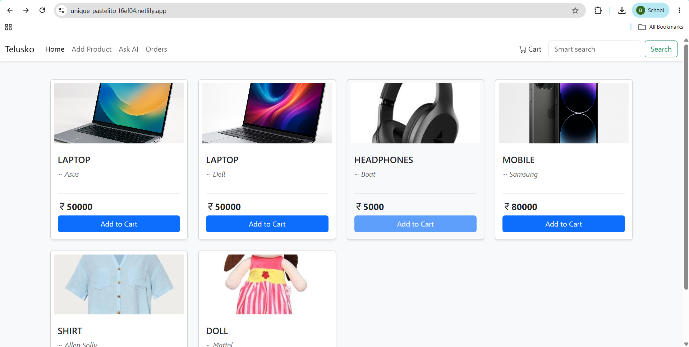
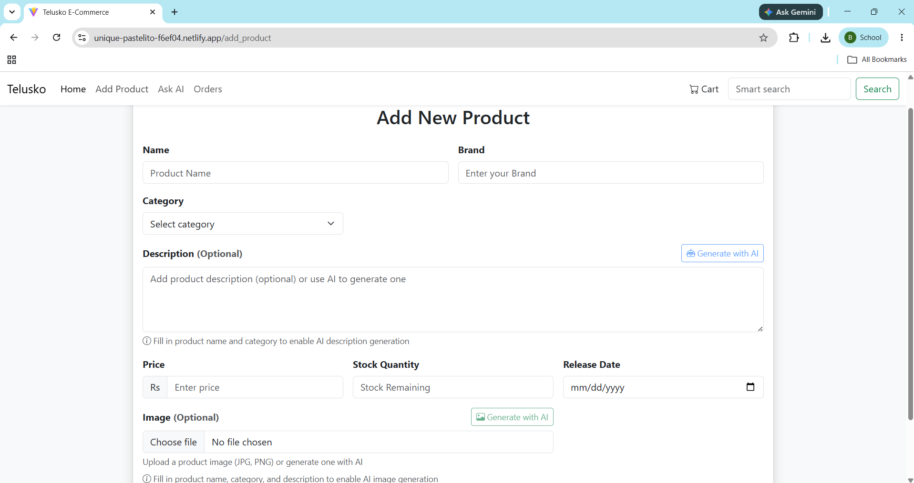
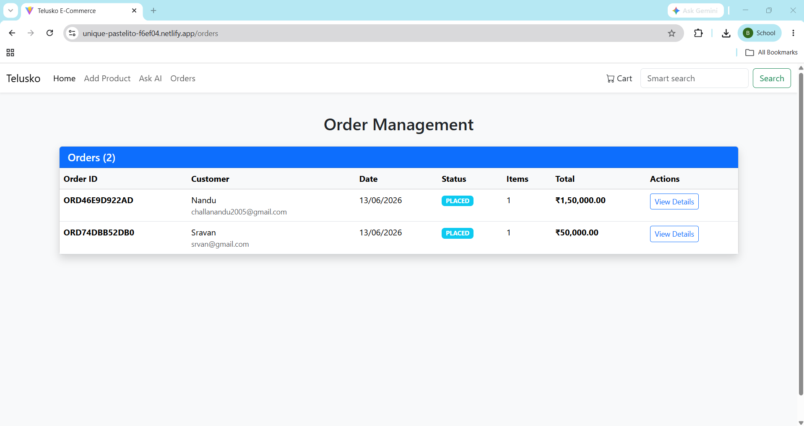
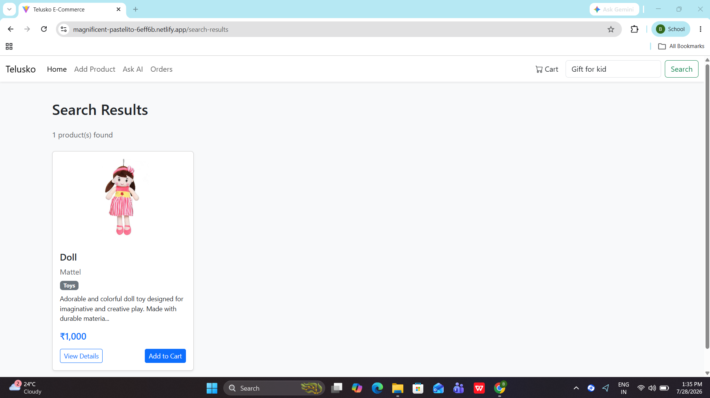
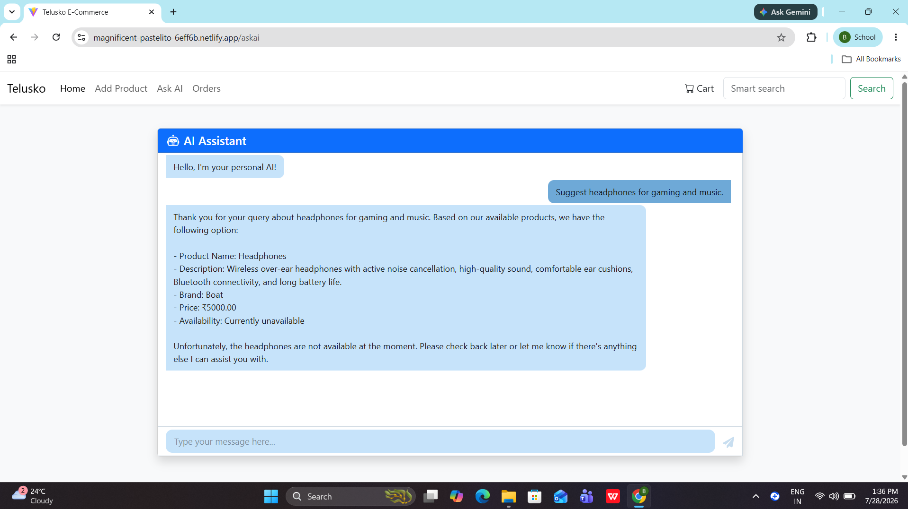

# 🛒 Ecom AI Web

An AI-powered eCommerce platform built with **Spring Boot**, **React**, and **OpenAI** that provides intelligent product discovery using **semantic search**, AI shopping assistance, and a complete online shopping experience.


---

# 🚀 Features

### 🛍️ E-Commerce

- User Registration & Login
- JWT Authentication
- Role-Based Authorization (Admin/User)
- Product Catalog
- Category Filtering
- Shopping Cart
- Order Management
- Admin Dashboard
- Product Image Upload
- Responsive UI

### 🤖 AI Features

- AI Shopping Assistant
- Semantic Product Search
- Vector Embeddings
- Context-Aware Recommendations
- Natural Language Product Discovery
- Intelligent Product Suggestions

---

# 🖼️ Screenshots

## 🏠 Home Page



---

## ➕ Add Product



---

## 📦 Orders



---

## 🔍 Semantic Search



---

## 🤖 AI Shopping Assistant



---

# 🛠️ Tech Stack

## Backend

- Java 21
- Spring Boot
- Spring MVC
- Spring Security
- Spring Data JPA
- Hibernate
- JWT Authentication
- MySQL
- Maven

## AI

- Spring AI
- OpenAI API
- Embedding Models
- Vector Search
- Semantic Search

## Frontend

- React
- Vite
- Axios
- CSS

## DevOps

- Docker
- Docker Compose
- Render
- Netlify

---

# 📂 Project Structure

```
src/
 ├── controller/
 ├── service/
 ├── repository/
 ├── model/
 ├── dto/
 ├── config/
 ├── security/
 ├── exception/
 └── resources/
```

---

# ⚙️ Installation

## 1. Clone Repository

```bash
git clone https://github.com/yourusername/ecom-ai-web.git

cd ecom-ai-web
```

---

## 2. Configure Database

Update:

```
application.properties
```

```properties
spring.datasource.url=
spring.datasource.username=
spring.datasource.password=
```

---

## 3. Configure OpenAI

```properties
spring.ai.openai.api-key=YOUR_API_KEY
```

---

## 4. Build Project

```bash
mvn clean install
```

---

## 5. Run

```bash
mvn spring-boot:run
```

Backend runs on

```
http://localhost:8080
```

---

# 🐳 Docker

Build

```bash
docker build -t ecom-ai .
```

Run

```bash
docker run -p 8080:8080 ecom-ai
```

Or

```bash
docker-compose up
```

---

# 🔐 Authentication

Uses **JWT Authentication**.

Protected APIs require:

```
Authorization: Bearer <JWT_TOKEN>
```

---

# 📡 API Modules

- Authentication
- Products
- Categories
- Cart
- Orders
- Users
- AI Chat
- Semantic Search

---

# 🤖 AI Workflow

```
User Query
      │
      ▼
OpenAI Embedding
      │
      ▼
Vector Similarity Search
      │
      ▼
Relevant Products
      │
      ▼
LLM Generates Context-Aware Response
```

---

# 📈 Future Enhancements

- Payment Gateway Integration
- Wishlist
- Product Reviews
- Email Notifications
- Inventory Management
- Recommendation Engine
- Admin Analytics Dashboard
- Multi-language Support

---

# 👨‍💻 Author

**Nandeshwar Reddy**

Java Backend Developer

- Spring Boot
- Spring Security
- REST APIs
- Spring AI
- OpenAI
- Semantic Search
- MySQL
- Docker

---

# ⭐ If you like this project

Give this repository a ⭐ on GitHub.

It motivates me to build more AI-powered backend applications.
